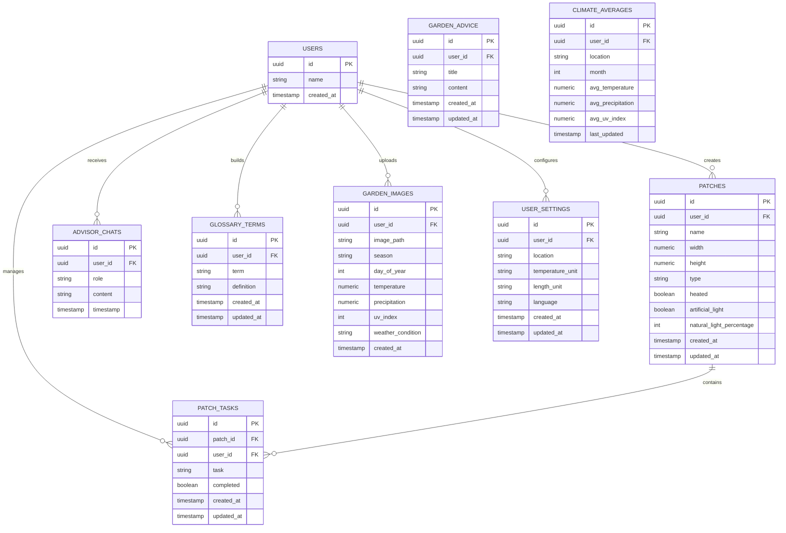
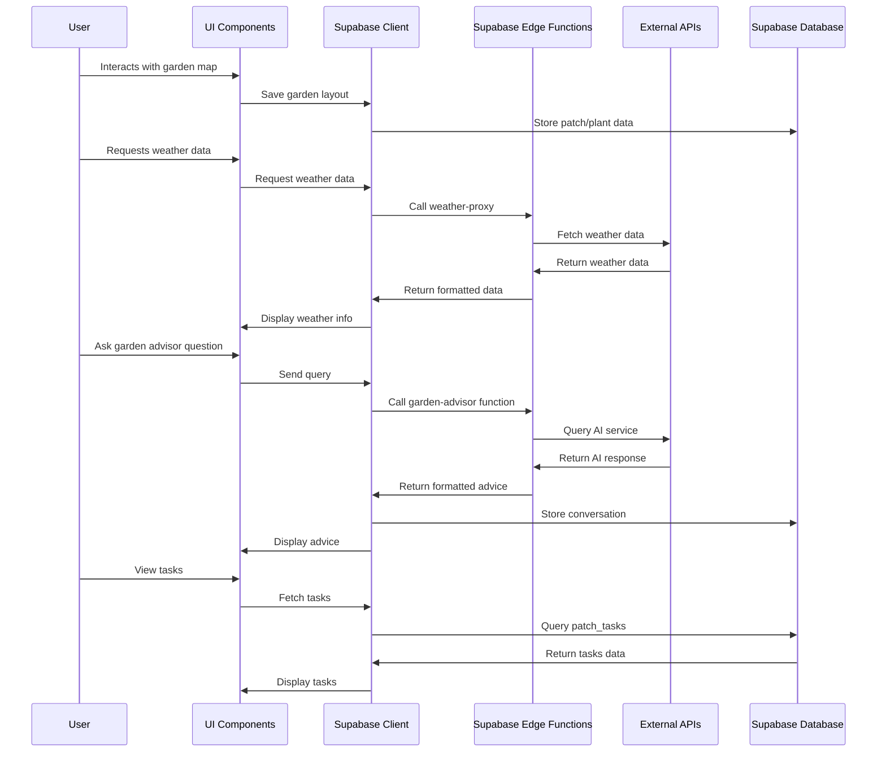

# Playful Garden Application Development Prompt

## Overview
Create a full-stack garden planning and management application called "Playful Garden" that enables users to design, plan, and manage their gardens with interactive tools, AI-powered advice, and environmental data integration. The application should help garden enthusiasts track their plants, plan garden layouts, receive personalized guidance, and monitor weather conditions affecting their gardens.

## Technology Stack
- **Frontend**: React (18+) with TypeScript using Vite as the build tool
- **Styling**: Tailwind CSS with shadcn/ui component library
- **State Management**: React Query for server state, React Context for global UI state
- **Backend**: Supabase for authentication, database, edge functions, and storage
- **External APIs**: Weather data API, NASA satellite imagery
- **Data Visualization**: Recharts for weather and growth charts
- **Drag and Drop**: react-dnd for interactive garden planning
- **Content Rendering**: React Markdown for rendering formatted content

## Best Practices to Follow
1. **Component Architecture**:
   - Create small, focused components (<150 lines) with clear responsibilities
   - Use composition over inheritance for component reuse
   - Separate presentational components from container components

2. **State Management**:
   - Use React Query for all API data fetching with properly configured query keys
   - Implement optimistic updates for better UX when modifying data
   - Store transient UI state locally within components
   - Use context for cross-cutting concerns like theme or authentication

3. **Performance Optimization**:
   - Utilize React.memo for expensive rendering components
   - Implement virtualization for long lists (especially in the task list)
   - Use proper key props for list rendering
   - Implement code splitting for larger features

4. **Error Handling**:
   - Add comprehensive error boundaries around major feature sections
   - Use toast notifications for user feedback
   - Implement retry mechanisms for network requests
   - Add fallback UI states for error scenarios

5. **Accessibility**:
   - Ensure proper keyboard navigation
   - Add ARIA attributes where needed
   - Maintain sufficient color contrast
   - Test with screen readers

6. **Responsive Design**:
   - Design mobile-first but optimize for desktop garden planning
   - Use flexbox and grid layouts for responsive components
   - Implement different interaction patterns for touch devices

## Known Challenges and Solutions

### Challenge 1: Managing Complex Garden Layouts
**Solution**: Implement a grid-based layout system using react-dnd with separate components for each interaction type. Store position data in a normalized format and use efficient rendering techniques.

### Challenge 2: Real-time Weather Data Integration
**Solution**: Cache weather data locally with appropriate TTL, implement a Supabase edge function for securely calling weather APIs, and create fallback displays when API limits are reached.

### Challenge 3: Large Component Files
**Solution**: Refactor large files (GardenAdvisor.tsx, GardenMap.tsx, TasksContent.tsx) into smaller, single-responsibility components within feature folders. Use hooks to extract business logic.

### Challenge 4: AI Garden Advisor Performance
**Solution**: Implement server-side processing with Supabase edge functions, client-side caching of responses, and a message queue system for handling advisory requests during API outages.

### Challenge 5: Database Schema Design
**Solution**: Use a properly normalized schema with foreign key relationships and appropriate indexes. Implement row-level security policies for user data protection.

## Application Structure

### Core Pages and Components

#### 1. Garden Dashboard (`src/components/GardenDashboard.tsx`)
The main hub of the application featuring:
- Garden map visualization
- Weather widget
- Satellite imagery
- Quick access to garden advisor
- Access to glossary and task management

#### 2. Garden Map (`src/components/GardenMap.tsx`)
Interactive garden planning tool featuring:
- Drag and drop plant placement
- Multiple garden patches with different characteristics
- Plant categorization and filtering
- Garden layout visualization

#### 3. Garden Advisor (`src/components/GardenAdvisor.tsx`)
AI-powered garden assistance featuring:
- Chat interface for gardening questions
- Automated daily tips based on garden state and weather
- Task generation and tracking
- Knowledge base integration with glossary terms

#### 4. Tasks Management (`src/components/TasksContent.tsx`)
Task tracking system featuring:
- Garden tasks organized by patch
- Completion status tracking
- Task filtering and grouping
- Priority indication

#### 5. Weather Integration (`src/components/WeatherWidget.tsx`)
Weather monitoring system featuring:
- Current conditions display
- Forecast integration
- Sunrise/sunset information
- Historical weather data tracking

## Database Schema

## Component Hierarchy

```mermaid
graph TD
    App[App.tsx] --> Index[pages/Index.tsx]
    App --> Settings[pages/Settings.tsx]
    App --> NotFound[pages/NotFound.tsx]
    
    Index --> GardenDashboard[components/GardenDashboard.tsx]
    
    GardenDashboard --> GardenSidebar[components/GardenSidebar.tsx]
    GardenDashboard --> WeatherWidget[components/WeatherWidget.tsx]
    GardenDashboard --> NasaSatelliteView[components/NasaSatelliteView.tsx]
    GardenDashboard --> GardenAdvisor[components/GardenAdvisor.tsx]
    GardenDashboard --> GlossaryPanel[components/GlossaryPanel.tsx]
    GardenDashboard --> GardenMap[components/GardenMap.tsx]
    GardenDashboard --> PatchManager[components/PatchManager.tsx]
    GardenDashboard --> CareSchedule[components/CareSchedule.tsx]
    
    WeatherWidget --> WeatherMainInfo[components/WeatherComponents/WeatherMainInfo.tsx]
    WeatherWidget --> WeatherDetails[components/WeatherComponents/WeatherDetails.tsx]
    WeatherWidget --> SunriseSunsetInfo[components/WeatherComponents/SunriseSunsetInfo.tsx]
    WeatherWidget --> WeatherLoadingSkeleton[components/WeatherComponents/WeatherLoadingSkeleton.tsx]
    WeatherWidget --> WeatherErrorDisplay[components/WeatherComponents/WeatherErrorDisplay.tsx]
    
    GardenAdvisor --> MarkdownRenderer[components/GardenMarkdown.tsx]
    
    GlossaryPanel --> GlossaryContent[components/GlossaryContent.tsx]
    
    GardenSidebar --> TasksContent[components/TasksContent.tsx]
    GardenSidebar --> AdviceContent[components/AdviceContent.tsx]
```

## Data Flow

## Implementation Steps and Features

### 1. Project Setup

- Initialize Vite React+TypeScript project
- Configure Tailwind CSS
- Set up shadcn/ui components
- Configure ESLint and Prettier
- Set up Supabase client

### 2. Authentication System

- Implement email/password authentication
- Add user profile management
- Create protected routes
- Implement persistent login

### 3. Garden Planning Features

- Create interactive garden map with grid
- Implement drag and drop for plants
- Build plant database with categories
- Design patch creation and management interface

### 4. Garden Advisor Integration

- Implement chat interface
- Connect to AI service via Supabase edge function
- Store and display conversation history
- Add daily tip generation

### 5. Weather Integration

- Create weather display components
- Implement Supabase edge function for API calls
- Add location-based weather fetching
- Design sunrise/sunset visualization

### 6. Task Management

- Create task creation interface
- Implement task completion tracking
- Add task grouping by garden area
- Design task filtering and sorting

### 7. Glossary System

- Create term highlighting and extraction from advisor
- Build glossary term database
- Implement glossary browsing interface
- Add term editing capabilities

### 8. Settings and Customization

- Create user preferences storage
- Implement unit selection (metric/imperial)
- Add location configuration
- Implement theme options

## Page-Specific Details

### Garden Dashboard

**Layout**: 
- Top navigation with app title and settings access
- Two-column layout with sidebar and main content area
- Responsive grid for different widget sizes
- Resizable panels for garden map and management tools

**Key Features**:
- Central hub for all garden management activities
- Weather and environmental data visualization
- Quick access to AI garden advisor
- Interactive garden map visualization
- Task and plant management tools

**Implementation Notes**:
- Use ResizablePanelGroup for flexible layout
- Implement context providers at this level
- Optimize rendering for widgets that update frequently
- Add keyboard shortcuts for common actions

### Garden Map

**Layout**:
- Grid-based visualization of garden patches
- Plant palette with categorization
- Search and filtering options
- Patch information display

**Key Features**:
- Drag and drop plant placement
- Multiple garden patches with different environments
- Plant organization by type (vegetables, herbs, flowers)
- Visual representation of garden layout

**Implementation Notes**:
- Use react-dnd for drag and drop functionality
- Implement custom grid rendering for performance
- Store positions in normalized format
- Add visual indicators for plant compatibility

### Garden Advisor

**Layout**:
- Chat-like interface with message history
- Input area with suggestion buttons
- Quick query options for common questions
- Visual distinction between user and AI messages

**Key Features**:
- AI-powered gardening advice
- Context-aware suggestions based on garden state
- Daily tips generation
- Task creation from advice
- Glossary term extraction

**Implementation Notes**:
- Implement message queue for API rate limiting
- Add offline support with cached responses
- Use markdown rendering for formatted responses
- Add typing indicators and loading states

### Tasks Management

**Layout**:
- Collapsible sections by garden area
- Visual indicators for task priority and completion
- Compact list view with action buttons
- Search and filter options

**Key Features**:
- Task tracking by garden area
- Completion status toggling
- Task deletion and editing
- Date-based organization

**Implementation Notes**:
- Implement virtualization for large task lists
- Add drag and drop for task reordering
- Use optimistic updates for responsive UI
- Implement batch operations for multiple tasks

### Weather Widget

**Layout**:
- Card-based layout with current conditions
- Detail sections for additional information
- Sunrise/sunset visualization
- Forecast preview

**Key Features**:
- Current weather conditions
- Temperature, humidity, wind data
- Precipitation forecast
- Sunrise/sunset times
- UV index information

**Implementation Notes**:
- Implement caching for weather data
- Add graceful degradation for API limits
- Use SVG for weather icons
- Create smooth transitions between data updates

## Key Supabase Edge Functions

### 1. `garden-advisor`
- **Purpose**: Process garden queries and generate AI-powered responses
- **Features**: Context awareness, garden state processing, task extraction
- **Integration**: Connects to external AI API

### 2. `weather-proxy`
- **Purpose**: Securely fetch weather data
- **Features**: Location-based queries, data formatting, caching
- **Integration**: External weather API service

### 3. `climate-data`
- **Purpose**: Process and analyze historical climate data
- **Features**: Seasonal averages, growing region information
- **Integration**: Climate databases and calculation logic

### 4. `nasa-imagery`
- **Purpose**: Fetch and process satellite imagery
- **Features**: Location-based queries, image processing
- **Integration**: NASA API services

## Maintenance and Best Practices

1. **Keep a CHANGELOG.md file** that follows the [Keep a Changelog](https://keepachangelog.com/) format
   - Update with every feature addition or bug fix
   - Categorize changes as Added, Changed, Deprecated, Removed, Fixed, or Security
   - Include date stamps for each version

2. **Implement regular refactoring**
   - Break down files that exceed 300 lines
   - Extract complex logic into custom hooks
   - Create shared utilities for common operations

3. **Maintain comprehensive error handling**
   - Add error boundaries around major feature areas
   - Implement graceful degradation for API failures
   - Add detailed logging for debugging purposes

4. **Optimize database queries**
   - Use appropriate indexes
   - Implement pagination for large data sets
   - Normalize data structure to avoid redundancy

5. **Keep dependencies updated**
   - Regularly check for security updates
   - Test thoroughly after dependency updates
   - Document any breaking changes

## Styling Guidelines

1. **Use Tailwind's utility classes** for most styling needs
2. **Create consistent component patterns** with shadcn/ui
3. **Maintain a garden-themed color palette** focused on greens, browns, and earth tones
4. **Ensure responsive behavior** across device sizes
5. **Implement dark mode support** for all components

## Testing Strategy

1. **Unit tests** for utility functions and hooks
2. **Component tests** for UI elements
3. **Integration tests** for feature workflows
4. **End-to-end tests** for critical user journeys
5. **Accessibility testing** with appropriate tools

## Documentation Requirements

1. **Maintain a comprehensive README.md**
2. **Update CHANGELOG.md with every change**
3. **Add JSDoc comments** for all functions and components
4. **Create Storybook stories** for UI components
5. **Document database schema** and relationships

## Final Guidance

Focus on creating a delightful, intuitive experience for garden enthusiasts. Prioritize features that help users plan, track, and improve their gardens with minimal friction. Balance aesthetic appeal with functional utility, and ensure the application remains responsive and performant even with large garden data sets.

Make garden planning fun and accessible by leveraging interactive tools, AI assistance, and environmental data visualization, while maintaining a cohesive and intuitive user experience throughout the application.
